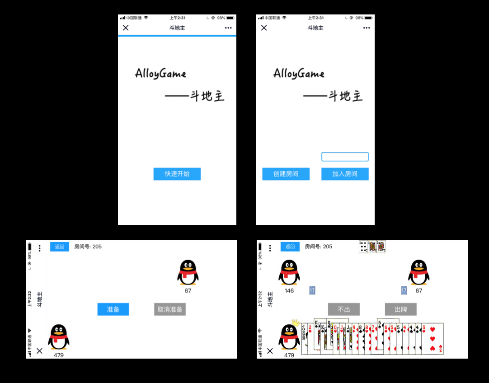

# landlord
Web在线斗地主游戏

# 游戏大概样式


# 前端构建
```
cd html/js
npm install
npm run dev
```

# 游戏运行
1. 映射前端目录
2. 启动server
3. 浏览器访问到index.html即可

# server端
运行
```
cd server
./server.out
```

重新编译
```
cd server
rm server.out
make
./server.out
```

# Webassembly构建（依赖emscripten sdk）
```
cd assembly
emmake make
```

